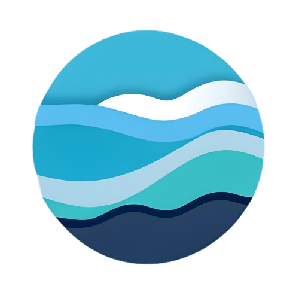

# Osion

Osion is a platform for easily creating notes and making them available for everyone. Anyone can view anyone's notes and can get knowledge.
   

## Technologies

### Backend

1. Spring boot
2. MySQL
3. OAuth
4. Custom file server

### Frontend

1. NextJS
2. TailwindCSS
3. Axios
4. Custom Markdown compiler

### Custom Markdown compiler

1. Vanilla JS
2. JQuery
      

## Features

### App

-   User Accounts
-   Doc creation
-   Doc editing
-   Doc viewing
-   Doc sharing
-   Advance website wide search

### Custom Markdown compiler

-   Basic markdown features as mentioned [here](https://www.markdownguide.org/basic-syntax)
-   Shapes (Quadrilaterals, Traingles, Circles, Textboxes, Images)
-   Annotations
    -   Highlighter pen with multiple colors
    -   Comment notes
    -   Drawing pen
